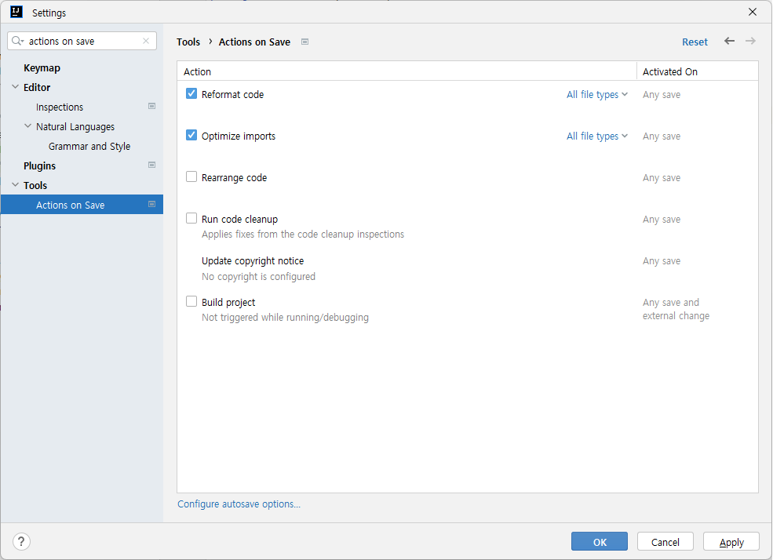
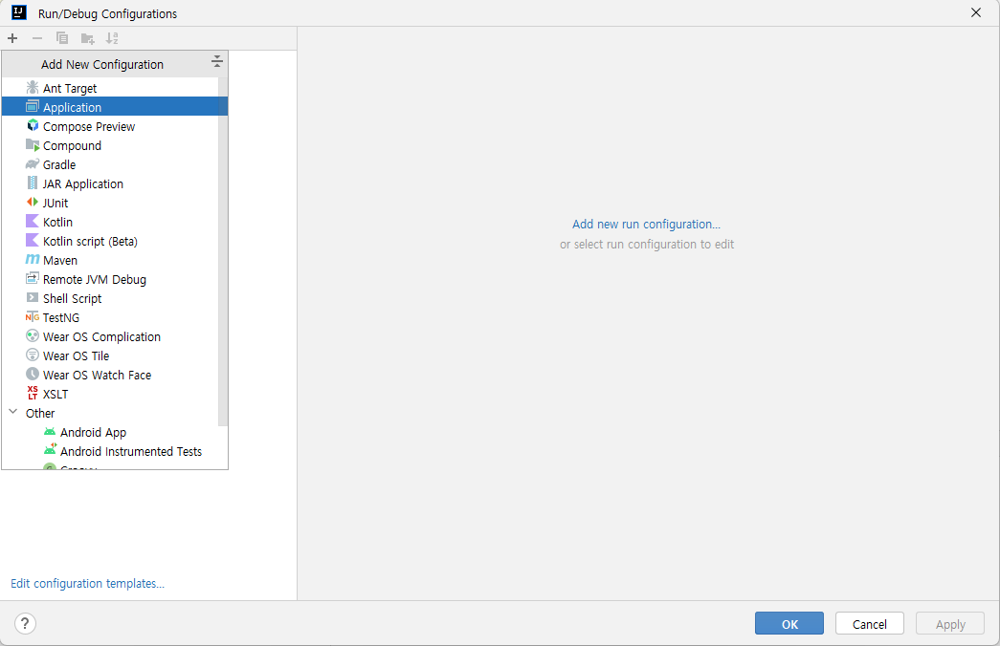
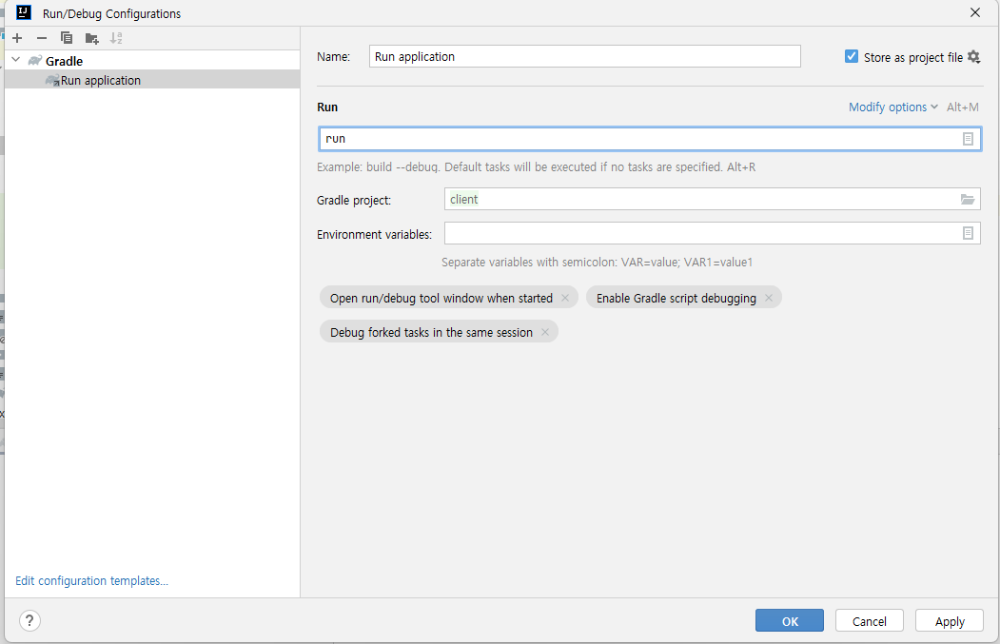

<!-- markdownlint-disable MD033 -->
# TCP Client

## 프로젝트 생성

* Gradle을 이용하여 새 프로젝트를 생성한다.

```cmd
Microsoft Windows [Version 10.0.22621.1265]
(c) Microsoft Corporation. All rights reserved.

C:\Users\yoo\Documents\GitHub\Toy.JavaHttp\client>gradle init
Starting a Gradle Daemon, 1 incompatible and 1 stopped Daemons could not be reused, use --status for details

Select type of project to generate:
  1: basic
  2: application
  3: library
  4: Gradle plugin
Enter selection (default: basic) [1..4] 2

Select implementation language:
  1: C++
  2: Groovy
  3: Java
  4: Kotlin
  5: Scala
  6: Swift
Enter selection (default: Java) [1..6] 3

Split functionality across multiple subprojects?:
  1: no - only one application project
  2: yes - application and library projects
Enter selection (default: no - only one application project) [1..2] 1

Select build script DSL:
  1: Groovy
  2: Kotlin
Enter selection (default: Groovy) [1..2] 1

Generate build using new APIs and behavior (some features may change in the next minor release)? (default: no) [yes, no]                                                                                                                       yes

Select test framework:
  1: JUnit 4
  2: TestNG
  3: Spock
  4: JUnit Jupiter
Enter selection (default: JUnit Jupiter) [1..4] 4

Project name (default: Toy.JavaHttp): client
Source package (default: client): com.mark.http.client

> Task :init
Get more help with your project: https://docs.gradle.org/8.0.2/samples/sample_building_java_applications.html

BUILD SUCCESSFUL in 1m 37s
2 actionable tasks: 2 executed
C:\Users\yoo\Documents\GitHub\Toy.JavaHttp\client>
```

## 프로젝트 열기

* Intellij 실행
* 상단 메뉴바 에서 파일 > 열기 > C:\Users\yoo\Documents\GitHub\Toy.JavaHttp\client 선택

## 프로젝트 구성

### 주석 삭제하기

#### 원본 소스 코드

```java
/*
 * This Java source file was generated by the Gradle 'init' task.
 */
package com.mark.http.client;

public class App {
    public String getGreeting() {
        return "Hello World!";
    }

    public static void main(String[] args) {
        System.out.println(new App().getGreeting());
    }
}
```

#### 주석 삭제 후

```java
package com.mark.http.client;

public class App {
    public String getGreeting() {
        return "Hello World!";
    }

    public static void main(String[] args) {
        System.out.println(new App().getGreeting());
    }
}
```

### 테스트 삭제하기

Ctrl + Shift + T 로 테스트 클래스로 이동

#### 테스트 소스 코드

```java
/*
 * This Java source file was generated by the Gradle 'init' task.
 */
package com.mark.http.client;

import org.junit.jupiter.api.Test;
import static org.junit.jupiter.api.Assertions.*;

class AppTest {
    @Test void appHasAGreeting() {
        App classUnderTest = new App();
        assertNotNull(classUnderTest.getGreeting(), "app should have a greeting");
    }
}
```

#### 테스트 소스 코드 수정

```java
package com.mark.http.client;

import org.junit.jupiter.api.Test;
import static org.junit.jupiter.api.Assertions.*;

class AppTest {
}
```

#### 설정 추가



## 시작 설정

* 상단 메뉴바 에서 Run > Edit Configurations



* Gradle 프로젝트를 추가



* 위의 화면과 같이 파라미터를 입력

## 클라이언트 만들기

* Ctrl + Space : Import 할 클래스 고를 수 있음.
* Alt + Enter: 오류 해결 가능

### 1.Connect

```java
String host = "example.com";
int port = 80;

Socket socket = new Socket(host, port);
System.out.println("Connect");

String message = """
        GET/ HTTP/1.1
        Host:example.com
        
        """;
```

* host : example.com
* port : 80 (http), 443(https)

### 2.Request

```java
boolean isUseWriter = true;

OutputStream outputStream = socket.getOutputStream();

if(isUseWriter){
    OutputStreamWriter outputStreamWriter = new OutputStreamWriter(outputStream);
    outputStreamWriter.write(message);
    outputStreamWriter.flush();
}
else {
    byte[] messageBytes = message.getBytes();
    outputStream.write(messageBytes);
    outputStream.flush();
}

System.out.println("Request");
```

### 3.Response

```java
InputStream inputStream = socket.getInputStream();

boolean isUseReader = true;

if(isUseReader){
    InputStreamReader inputStreamReader = new InputStreamReader(inputStream);
    CharBuffer charBuffer = CharBuffer.allocate(readBufferSize);
    int readSize = inputStreamReader.read(charBuffer);

    charBuffer.flip();

    System.out.println("Read Size : " + readSize);
    System.out.println(charBuffer.toString());
}
else{
    byte[] readBytes = new byte[readBufferSize];
    int readSize = inputStream.read(readBytes);

    System.out.println("Read Size : " + readSize);

    // TODO : (dh) byte to string
}

System.out.println("Response");
```

### 4.Client

```java
socket.close()
```

* 소켓 종료

or

```java
  try (Socket socket = new Socket()){
    
  }
  catch(Exception e){
    e.printStackTrace();
  }
```

* C# 에서 using과 같은 기능
