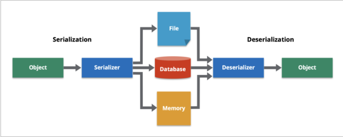

<!-- markdownlint-disable MD033 -->
# 직렬화 & 마샬링 & JSON

## 개념도

* jSON < 직렬화 < 마샬링

## [직렬화](https://ko.wikipedia.org/wiki/%EC%A7%81%EB%A0%AC%ED%99%94)

* <=> Deserialization
* 객체를 전송하기 위해 바이트 단위(stream)로 변환하는 것을 뜻함

## [마샬링](https://ko.wikipedia.org/wiki/%EB%A7%88%EC%83%AC%EB%A7%81_(%EC%BB%B4%ED%93%A8%ED%84%B0_%EA%B3%BC%ED%95%99))

* <=> unmarshalling
* bytestream 으로 변환하는 '과정'을 뜻함
  * 직렬화된 객체를 바이트 단위로 분해한다. (marshalling)
  * 직렬화 되어 분해된 데이터를 순서에 따라 전송한다.
  * 분해된 바이트를 다시 객체로 조립한다. (unmarshalling)
* 타 프로세스와 통신하기 위해 객체를 바이트 단위로 분해하는 과정을 뜻함

## [JSON](https://developer.mozilla.org/ko/docs/Learn/JavaScript/Objects/JSON)

### JavaScript Object Notation

* Douglas Crockford 가 만듬 
* 데이터를 전송하기 위한 텍스트 기반의 데이터 포맷
* 키-값 쌍으로 이루어진 데이터 객체를 표현하는데 사용
* 키는 반드시 큰따옴표로 감싸야 함
* JSON은 자바스크립트의 객체 리터럴 문법과 매우 유사함

### Java 에서 JSON 사용하기

* Map 이 유사
* 스키마 관리 및 타입 안정선을 위해 DTO 를 사용
  * 생성: DTO (Java 세계) → 변환기 → JSON 문자열
  * 해석: JSON 문자열 → 변환기 → DTO (Java 세계)
* 주로 Jackson 라이브러리를 사용하여 JSON 문자열과 DTO 를 변환
* Spring 에서는 Jackson 을 기본으로 사용

### 사용처

* 공개 Interface 일때
* 데이터 전송 목적이기만 하면 어디서든 사용 가능
* 일반적으로 Controller 에서 변환됨